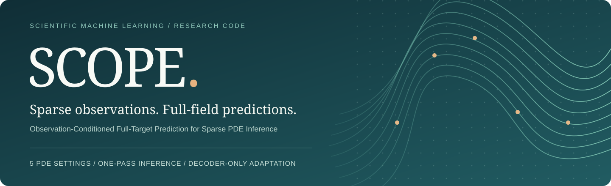
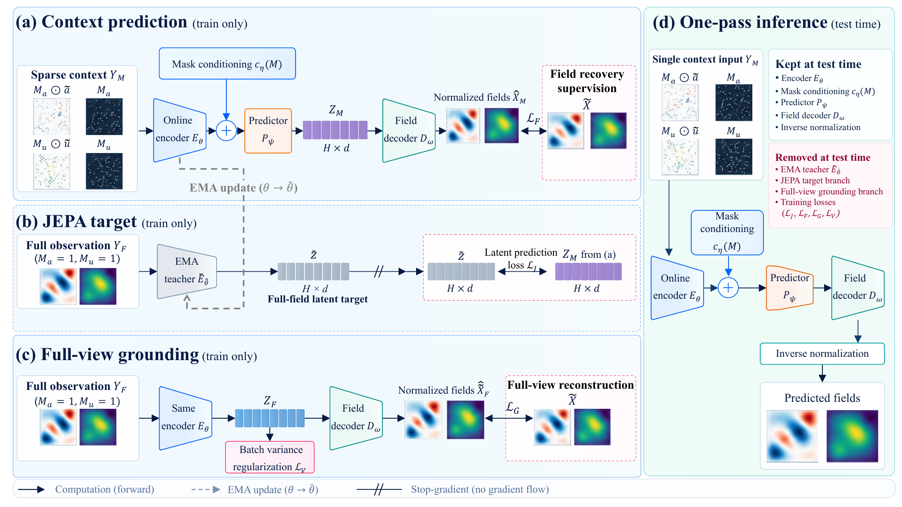
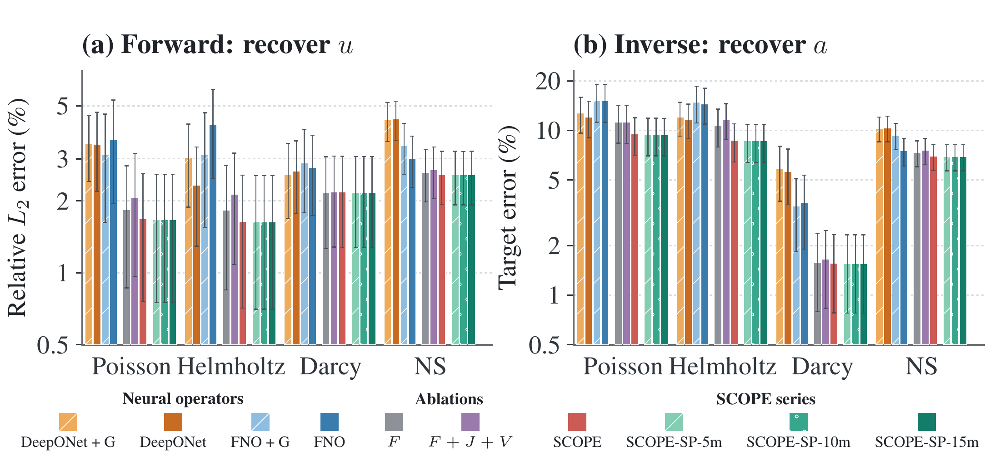

<p align="center">
  <a href="https://ru1ch3n.github.io/SCOPE/"></a>
</p>

<h1 align="center">SCOPE</h1>
<p align="center"><strong>Observation-Conditioned Full-Target Prediction for Sparse PDE Inference</strong></p>

<p align="center">Ruichen Xu · Siyao Wang · Fang Wan · Jiacheng Qiu · Wenhan Gao · Jiaxing Zhang<br>
Linsey Pang · Ravid Shwartz-Ziv · Prakhar Mehrotra · Yann LeCun · Yuefan Deng</p>

<p align="center">
  <a href="https://ru1ch3n.github.io/SCOPE/"></a>
  <a href="https://github.com/ru1ch3n/SCOPE/actions/workflows/tests.yml"></a>
  <a href="#quick-start"></a>
  <a href="docs/DATA.md"></a>
  <a href="docs/MODELS.md"></a>
</p>

<p align="center">
  <a href="https://github.com/ru1ch3n/SCOPE"><strong>ru1ch3n/SCOPE</strong></a> &nbsp; / &nbsp;
  <a href="https://ru1ch3n.github.io/SCOPE/"><strong>Project page</strong></a> &nbsp; / &nbsp;
  <a href="#quick-start">Quick start</a> &nbsp; / &nbsp;
  <a href="docs/PROTOCOL.md">Protocol</a> &nbsp; / &nbsp;
  <a href="docs/MODELS.md">Models</a> &nbsp; / &nbsp;
  <a href="docs/RESULTS.md">Results &amp; scope</a>
</p>

---

## Sparse observations. Full-field predictions.

SCOPE reconstructs paired physical fields from observed values and their masks
in one forward pass. Full-target latent prediction and shared physical grounding
train the backbone. **SCOPE-SP** then optionally fits a replacement decoder on
frozen sparse-context representations, without test-time optimization.

| Predict the whole | Ground the representation | Adapt only the readout |
|:---|:---|:---|
| A shared inference pathway supports **forward, inverse and joint** recovery within each PDE. | Full-target latent prediction is coupled to **physical field reconstruction**. | **SCOPE-SP** fits a new decoder on frozen sparse-context latents. |

<p align="center"><a href="docs/assets/architecture.png"></a></p>

*Training uses complete-field supervision; inference sees only the observation
context. The EMA teacher and auxiliary grounding branch are training-only.
Field maps above are schematic, not experimental predictions.*

> **Release status:** code and reproducible recipes are public. Final pretrained
> weights are being packaged and verified; follow [model availability](docs/MODELS.md).
> An arXiv version is in preparation. The separate anonymous review distribution
> is preserved; no arXiv identifier or conference acceptance is implied.

## Quick start

Use Python 3.11 or 3.12. Full training needs an NVIDIA GPU with BF16 support;
48 GiB VRAM is a practical reference class. The installer pins PyTorch 2.12.1 /
CUDA 13.0; install a compatible NVIDIA driver separately.

```bash
git clone https://github.com/ru1ch3n/SCOPE.git && cd SCOPE
```

**Environment and selected dataset, in one command:**

```bash
python3 tools/setup.py --pde poisson
```

Creates `.venv`, downloads only the selected public train/test data at a pinned
revision, verifies checksums and builds memory-mapped caches. No author account,
private server or token is needed. See [disk requirements](docs/DATA.md).

**Train Full (10 pretraining + 500 main epochs):**

```bash
.venv/bin/python -m scope.train --config configs/poisson.json
```

Rolling checkpoints are saved each epoch; 10-epoch milestones are retained.
There is no automatic mid-training test evaluation. Add `--resume` to continue.

**Fit the SP decoder (100 epochs, frozen backbone):**

```bash
.venv/bin/python -m scope.probe --base runs/poisson --size 10m --observation uniform500
```

**Test SCOPE-SP-10M:**

```bash
.venv/bin/python -m scope.evaluate --run runs/probes/10m-uniform500-full-poisson --protocol uniform3
```

For native Full, use `--run runs/poisson`. `uniform3` means **500 / 16,384 =
3.0518%** visible points, not exactly 3%. Forward observes `a` and evaluates
`u`; inverse observes `u` and evaluates `a`. JSON summaries and per-record
NPZ errors go to the run's evaluation directory.

On Windows replace `.venv/bin/python` with `.venv\Scripts\python.exe`.
On a shared cluster, train inside an allocated GPU job, not a login node.

## Five PDE settings

Replace `poisson` consistently in commands and paths:

| Configuration | Train / test records | Fields | Primary metrics |
|---|---:|---|---|
| `poisson` | 50,000 / 1,024 | source / solution | relative L2 |
| `helmholtz` | 50,000 / 10,000 | benchmark input / response | relative L2 |
| `darcy` | 50,000 / 10,000 | permeability / solution | forward relative L2; inverse BER |
| `ns-nonbounded` | 50,000 / 1,000 | earlier / later vorticity | relative L2 |
| `ns-bounded` | 14,000 / 1,000 | earlier / later speed, internal cylinder | qualified relative L2 and absolute RMSE |

`ns-nonbounded` denotes the no-obstacle dataset, not an infinite domain.
Cylinder conditioning and zero-target handling are explicit in
[PROTOCOL.md](docs/PROTOCOL.md).

## Architecture and objectives

Inference: `masked fields + masks -> encoder -> predictor -> decoder`.
The EMA teacher and grounding pathway are training-only. There is no independent
JEPA mask hiding additional observations.

| Component | Configuration |
|---|---|
| Input | 128 x 128; four masked-field/mask channels |
| Encoder | 8 x 8 patches, width 512, depth 12, 8 heads |
| Latent / predictor | 256 x 128 tokens; predictor width 256, depth 2 |
| Native decoder | nonlinear patch MLP and convolutional refinement |
| Online parameters | 40,040,834; EMA teacher counted separately |
| Batch / optimizer | 32; AdamW, peak LR 1.25e-4, weight decay 0.05 |
| Task distribution | forward / inverse / joint: 40% / 40% / 20% |
| Observation families | uniform, regular grid, lines, cluster, block; 20% each |
| Batch conditions | one task, family and nominal observation budget per batch |

Full combines physical relative-L2 field loss, JEPA latent MSE, complete-view
grounding and variance regularization. A measured component-gradient-norm guard
scales auxiliaries down when needed; scalar weights are not gradient shares.

Supported ablations are `fo` (field only, no pretraining), `fjv` (no main-stage
grounding), `fg` (field + grounding) and `fjvg` (grounding gradient only to the
decoder). A supported recipe is not evidence that its production run completed.
FO is not a single-term JEPA ablation. See [VARIANTS.md](docs/VARIANTS.md).

```bash
.venv/bin/python -m scope.train --config configs/variants/fjv-poisson.json
```

SP (`--observation uniform500`) fits frozen predicted sparse-context latents.
DP (`--observation full`) is a **different diagnostic**, fitting complete-view
encoder latents. Both support `5m`, `10m` and `15m` heads.
Transfer results do not establish equality of latent distributions.

## Software checks

```bash
python3 tools/setup.py --cpu --env-only
.venv/bin/python -m pytest -q
.venv/bin/python -m ruff check .
```

```bash
.venv/bin/python -m scope.train --smoke
.venv/bin/python -m scope.evaluate --run runs/smoke --device cpu
```

The smoke test is synthetic, not a PDE result. CPU checks do not establish a
500-epoch CUDA rerun or bitwise equivalence across GPU generations.

## Grounding and readout: what we compare

<p align="center"><a href="docs/assets/comparison.png"></a></p>

*Existing manuscript figure, unchanged. Mean errors with per-record SD on
logarithmic axes. Darcy inverse uses BER. Auxiliary neural operators have their
own protocols and metric-unit conventions; these are within-family supervision
controls, not the matched main-table operator comparison.*

| Comparison | Question | Important distinction |
|---|---|---|
| Full vs FJV | Does main-stage grounding help within the predictive recipe? | Removing a term also changes auxiliary gradient scaling. |
| Full vs FO | What does the complete pipeline add to field-only training? | FO also omits pretraining; this does not isolate JEPA. |
| Native Full vs SP | Can a frozen representation support an improved physical readout? | Adaptation adds decoder capacity and optimization. |
| Matched-size DP vs SP | Does decoder fitting benefit from the deployment latent pathway? | Complete-view versus sparse-context fitting, with the same head size. |

See [results and comparison scope](docs/RESULTS.md), [probe recipes](docs/PROBES.md)
and [ablation definitions](docs/VARIANTS.md). Transfer behavior is not proof that
two latent distributions are identical.

## Repository guide

| Path | Purpose |
|---|---|
| `configs/` | explicit Full and ablation recipes |
| `src/scope/model.py` | encoder, predictor, decoder, EMA |
| `src/scope/losses.py` | objectives and gradient guard |
| `src/scope/observations.py` | observation families and batch conditions |
| `src/scope/train.py`, `probe.py`, `evaluate.py` | experiment entrypoints |
| `tools/setup.py` | environment/data preparation |
| `tests/` | data, masks, objectives, variants, probes, resume checks |
| `docs/` | [operations](docs/OPERATIONS.md), protocols and release limitations |

Final pretrained weights are release assets, not Git history. Dataset files,
optimizer histories, credentials and cluster launch scripts are not published.
See [MODELS.md](docs/MODELS.md) for actual availability and loading.

## Data and permissions

We use the [FunDPS-processed DiffusionPDE dataset](https://huggingface.co/datasets/jcy20/DiffusionPDE-normalized)
at a pinned revision. Fields stay on their original host. Data and derived
cylinder geometry retain their [CC BY-NC-SA 4.0](https://creativecommons.org/licenses/by-nc-sa/4.0/)
attribution; see [THIRD_PARTY.md](THIRD_PARTY.md).

The existing [review/reproduction permission](LICENSE) is retained.
Public visibility is not an assertion of an unrestricted open-source license.

## Citation

Author and software metadata are in [CITATION.cff](CITATION.cff). The arXiv
identifier and paper link will be added when available.

<p align="center"><a href="https://ru1ch3n.github.io/SCOPE/">Project website ↗</a> &nbsp; · &nbsp; <a href="#scope">Back to top ↑</a></p>
